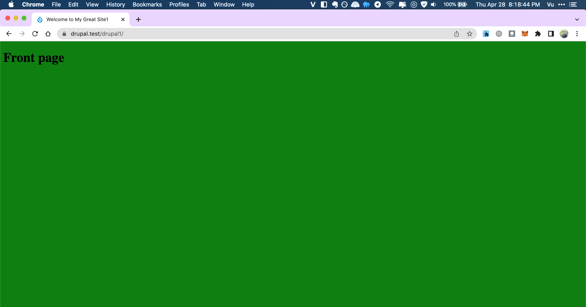
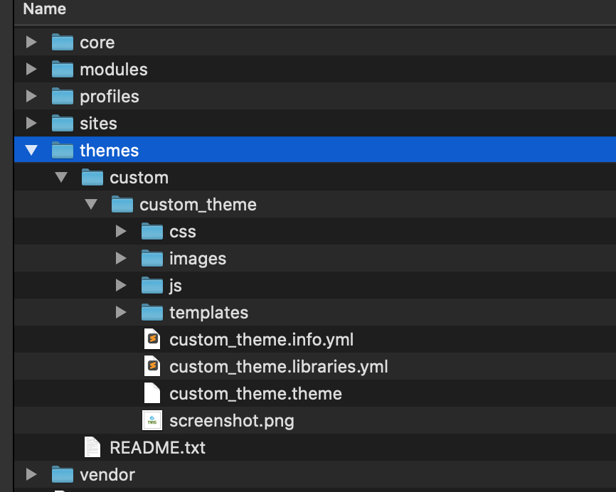

# drupal-example-theme
 drupal example theme 8-9
 

copy custom theme to [your_drupal]/themes/custom/[custom-theme]

this theme 
using page--front.html.twig for front page (home page)
using html.html.twig for struct html
using page.html.twig for default page

